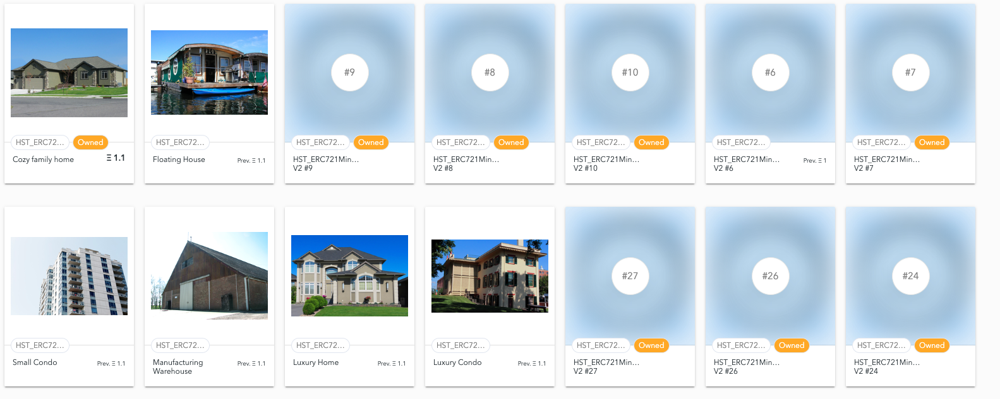
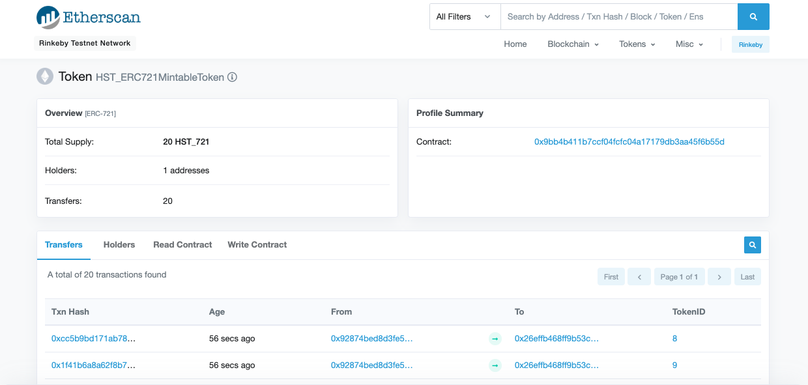
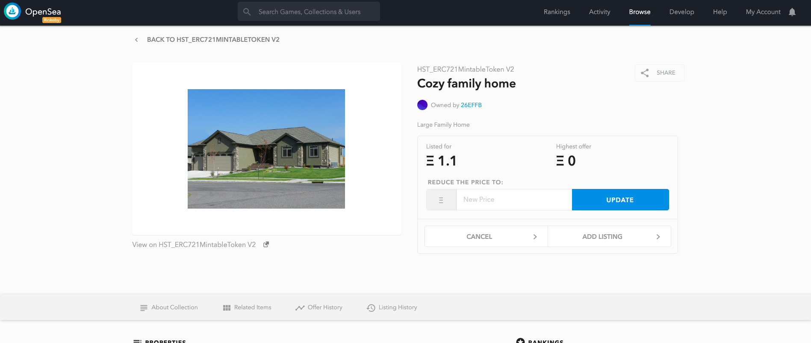
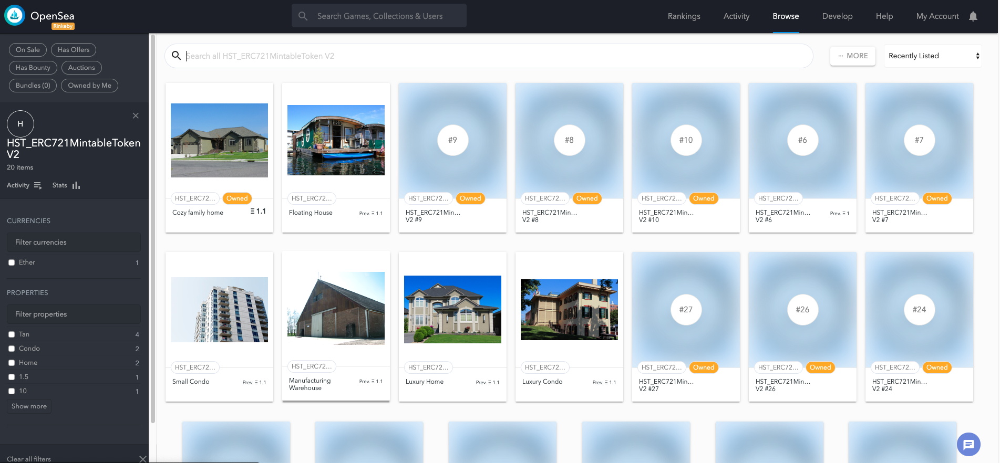

# Decentralized Real Estate Marketplace

A decentralized house listing service to prevent title issues that could be mitigated by blockchain technology.

  

## Versions

      truffle: Truffle v5.0.24
      truffle-compiler: 0.5.1+commit.c8a2cb62.Emscripten.clang

## Contracts

### SolnSquareVerifier.sol

<b>Note</b>: SolnSquareVerifier inherits all other contracts except verifier.sol

Completed contract that inherits the ERC721 token backed through zkSnarks that enhances privacy and scalability.

### verifier.sol

Implements Succinct Zero-knowledge proofs (zkSnarks).

---

## Quick Start Deploying to Ganache and Testing

1. cd into project repro & install modules

        cd Blockchain-Capstone-Real-Estate-Marketplace

        npm install

2. Compile Contracts

        truffle compile

1. Start ganache (CLI or GUI)

            ganache-cli

2. Mirgrate locally

              truffle migrate --network development --reset

#### Testing contracts

Testing ERC721

File: TestERC721Mintable.js

Test minting functionality of tokens and transfer of tokens.

    truffle test ./test/TestERC721Mintable.js

Test zkSnarks

File: TestSquareVerifier.js

Verifies zkSnarks is successfully implemented.

    truffle test ./test/TestSquareVerifier.js

Testing ERC721 token with zkSnarks

File: TestSolnSquareVerifier.js

Test minting with zkSnarks.

    truffle test ./test/TestSolnSquareVerifier.js

---

## Quick Start Deploying to Rinkeby

1. Make a new project with Infura

    Infura: https://infura.io

2. Setup truffle-config

    2.1 set infuraKey (line 22)

    2.2 set mnemonic from metamask within HDWalletProvider (line 53)

    2.3 set rinkeby endpoint within HDWalletProvider (line 53)

    2.4 set from address (line 57)

3. Migrate to rinkeby

        truffle migrate --network rinkeby

4. Finding ER721 token on ether-scan

  https://rinkeby.etherscan.io/token/0x9bb4b411b7ccf04fcfc04a17179db3aa45f6b55d

  

5. Minting tokens

  https://www.myetherwallet.com/interface/interact-with-contract

6. Finding tokes on rinkeby OpenSea

  https://rinkeby.opensea.io/assets/0x9bb4b411b7ccf04fcfc04a17179db3aa45f6b55d/1

  

7. Viewing token Storefront on Opensea

  https://rinkeby.opensea.io/assets/hst-erc721mintabletoken-v2

  

## assets

  https://rinkeby.opensea.io/assets/0x9bb4b411b7ccf04fcfc04a17179db3aa45f6b55d/0
  https://rinkeby.opensea.io/assets/0x9bb4b411b7ccf04fcfc04a17179db3aa45f6b55d/1
  https://rinkeby.opensea.io/assets/0x9bb4b411b7ccf04fcfc04a17179db3aa45f6b55d/2
  https://rinkeby.opensea.io/assets/0x9bb4b411b7ccf04fcfc04a17179db3aa45f6b55d/3
  https://rinkeby.opensea.io/assets/0x9bb4b411b7ccf04fcfc04a17179db3aa45f6b55d/4
  https://rinkeby.opensea.io/assets/0x9bb4b411b7ccf04fcfc04a17179db3aa45f6b55d/5

## Project Resources

* [Remix - Solidity IDE](https://remix.ethereum.org/)
* [Visual Studio Code](https://code.visualstudio.com/)
* [Truffle Framework](https://truffleframework.com/)
* [Ganache - One Click Blockchain](https://truffleframework.com/ganache)
* [Open Zeppelin ](https://openzeppelin.org/)
* [Interactive zero knowledge 3-colorability demonstration](http://web.mit.edu/~ezyang/Public/graph/svg.html)
* [Docker](https://docs.docker.com/install/)
* [ZoKrates](https://github.com/Zokrates/ZoKrates)
